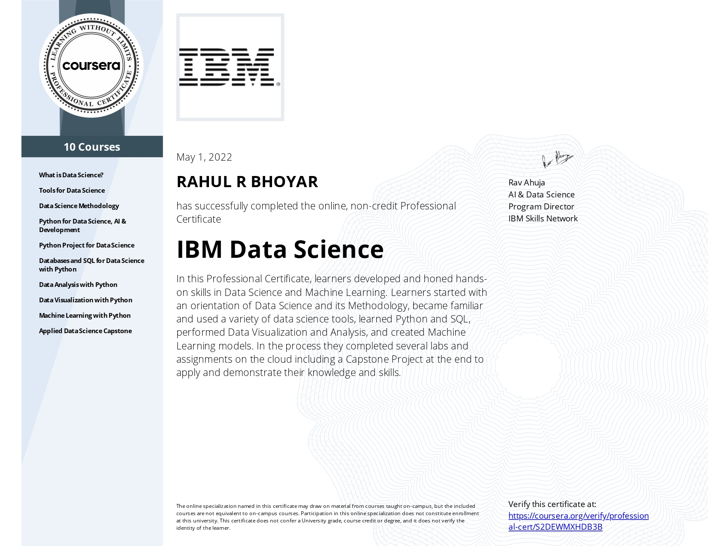

# IBM Data Science Professional Certification

by **IBM**

### Author : Rahul Bhoyar

Welcome to the repository for the IBM Data Science Professional Certificate program. Here, you'll find a comprehensive collection of code and resources designed to guide you through the exciting world of data science. Whether you're a beginner or an experienced programmer, this program offers a structured pathway to mastering essential skills in Python programming, data analysis, machine learning, and data visualization.

From understanding the fundamentals of data science to applying advanced machine learning techniques, each course in this program builds upon the previous one, providing you with a solid foundation and practical experience. With hands-on projects and real-world applications, you'll gain the confidence and expertise needed to tackle complex data challenges and excel in the field of data science and artificial intelligence.

**Contents:**

Certificates of the courses

**Courses in Certification Program :**

1. What is Data Science ?
2. Tools for Data Science
3. Data Science Methodology
4. Python for Data Science, AI and Development
5. Python Project for Data Science
6. Databases and SQL for Data Science with Python
7. Data Analysis with Python
8. Data Visualization with Python
9. Machine Learning with Python
10. Applied Data Science Capstone

**Certificate :**

Certification completed on **1st May 2022**.

**Link for verification :**

[Coursera IBM Data Science Professional Certification](https://www.coursera.org/account/accomplishments/professional-cert/S2DEWMXHDB3B)

